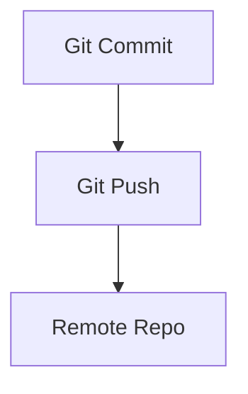

---

# 📝 Git & Linux 101 Notları

## 1. Linux Paket Yönetimi

* **sudo** → Yönetici (root) yetkisi ile çalıştırır.
* **apt** → Ubuntu/Debian paket yöneticisi.
* **install** → Paket yükleme komutu.
* **-y** → Tüm sorulara otomatik **“Evet”** yanıtı verir.

📌 Örnek:

```bash
sudo apt install -y git
```

> ⚡ Not: RedHat/CentOS tarafında `apt` yerine **yum** veya **dnf** kullanılır.
> Örn: `sudo dnf install git -y`

---

## 2. Git Temelleri

* **Git** → Versiyon kontrol sistemi (kod geçmişini ve sürümleri tutar).
* **Repo (repository)** → Proje dosyalarının tutulduğu depo.
* **Commit** → Yapılan değişikliklerin kaydedilmesi.
* **Push** → Commit’leri uzak sunucuya gönderir.
* **Pull** → Uzak repodaki değişiklikleri indirir.
* **Stash** → Commit edilmemiş değişiklikleri geçici olarak saklar.

📌 Kullanıcı ayarları:

```bash
git config --global user.name "Adınız"
git config --global user.email "email@ornek.com"
```

📌 Commit ve Push örneği:

```bash
git add .
git commit -m "İlk commit"
git push origin main
```

> ✅ **Commit** → Lokalde kayıt
> ✅ **Push** → Sunucuya gönderim

---

## 3. CLI (Command Line Interface)

CLI = Komut satırı arayüzü. Terminal üzerinden sistemle iletişim kurmayı sağlar.

### Yaygın Komutlar:

```bash
ls      # Dosyaları listele
cd      # Dizin değiştir
pwd     # Hangi klasörde olduğunu göster
mkdir   # Yeni klasör oluştur
rm -rf  # Dosya/Klasör sil
history # Komut geçmişini göster
```

📌 Git özel:

```bash
git status   # Git durumunu göster
git log      # Commit geçmişini göster
```


## 5. Mermaid.js

**Kod ile diyagram çizmek** için kullanılan JS kütüphanesi.

📌 Örnek:



---

## 6. Markdown 101

Markdown → Hafif işaretleme dili.
**README.md**, dokümantasyon ve not tutma için kullanılır.

### Temel Biçimlendirme

* **Kalın** → `**metin**` → **metin**
* *İtalik* → `*metin*` → *metin*
* ~~Üstü çizili~~ → `~~metin~~` → ~~metin~~
* `Kod içinde` → `` `kod` ``
* Kod blokları:

````markdown
```bash
ls -la
````

````

```bash
ls -la
````

---

### Başlıklar

```markdown
# H1
## H2
### H3
#### H4
```

# H1

## H2

### H3

#### H4

---

### Listeler

* Sırasız liste:

```markdown
- Elma
- Armut
- Muz
```

* Elma

* Armut

* Muz

* Sıralı liste:

```markdown
1. Birinci
2. İkinci
3. Üçüncü
```

1. Birinci
2. İkinci
3. Üçüncü

---


### Tablo

```markdown
| Ad   | Yaş | Meslek   |
|------|-----|----------|
| Ali  | 25  | Yazılımcı|
| Ayşe | 28  | Doktor   |
```

| Ad   | Yaş | Meslek    |
| ---- | --- | --------- |
| Ali  | 25  | Yazılımcı |
| Ayşe | 28  | Doktor    |

---

### Alıntı (Blockquote)

```markdown
> Bu bir alıntıdır.
```

> Bu bir alıntıdır.

---

### Görev Listesi

```markdown
- [x] Git kuruldu
- [ ] Commit atıldı
- [ ] Push yapıldı
```

* [x] Git kuruldu
* [ ] Commit atıldı
* [ ] Push yapıldı

---

### LaTeX Matematik

```markdown
$E = mc^2$

$$\int_0^\infty e^{-x} dx = 1$$
```

\$E = mc^2\$

$\int_0^\infty e^{-x} dx = 1$

---

## 7. Ekstra İpuçları

* **Linux’te Yetki Verme**

```bash
chmod +x script.sh   # script çalıştırılabilir hale gelir
```

* **Git Branch Yönetimi**

```bash
git branch                  # branch’leri listele
git checkout -b yeni-branch # yeni branch oluştur ve geç
git merge feature           # feature branch’ini bulunduğun branch’e birleştir
```

* **SSH Key Oluşturma (GitHub için)**

```bash
ssh-keygen -t ed25519 -C "email@ornek.com"
```

